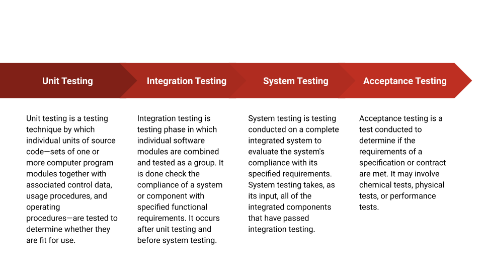

# pytest_tutorial

## Software Testing

Software testing is the process of evaluating and verifying that a software product or application does what it is supposed to do. The benefits of testing include preventing bugs, reducing development costs and improving performance.

### Type of testing:

-----

### Types of software testing:

1. **Manual Testing**: Manual testing is the process of manually testing software for defects. It requires a tester to play the role of an end user where by they use most of the application's features to ensure correct behaviour.

2. **Automated Testing**: In software testing, test automation is the use of software separate from the software being tested to control the execution of tests and the comparison of actual outcomes with predicted outcomes.
-----

### Most functional tests follow the Arrange-Act-Assert model:

1. Arrange, or set up, the conditions for the test
2. Act by calling some function or method
3. Assert that some end condition is true
